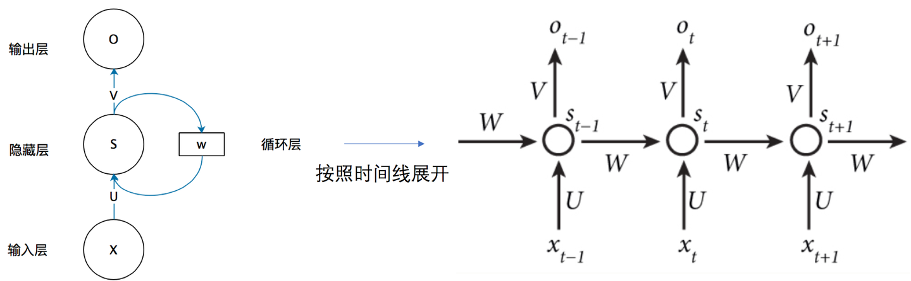

RNN的目的使用来处理序列数据。在传统的神经网络模型中，是从输入层到隐含层再到输出层，层与层之间是全连接的，每层之间的节点是无连接的。但是这种普通的神经网络对于很多问题却无能无力。例如，你要预测句子的下一个单词是什么，一般需要用到前面的单词，因为一个句子中前后单词并不是独立的。RNN之所以称为循环神经网路，即一个序列当前的输出与前面的输出也有关。具体的表现形式为网络会对前面的信息进行记忆并应用于当前输出的计算中，即隐藏层之间的节点不再无连接而是有连接的，并且隐藏层的输入不仅包括输入层的输出还包括上一时刻隐藏层的输出。



## 基础-全连接层
### code
```python
import torch
import torch.nn as nn
import torch.optim as optim
import torch.nn.functional as F
 
# 定义神经网络模型
class SimpleNN(nn.Module):
    def __init__(self, input_size, num_classes):
        super(SimpleNN, self).__init__()
        self.fc1 = nn.Linear(input_size, 64)  # 第一个全连接层
        self.fc2 = nn.Linear(64, 32)  # 第二个全连接层
        self.fc3 = nn.Linear(32, num_classes)  # 输出层，维度为类别数量
 
    def forward(self, x):
        x = F.relu(self.fc1(x))  # ReLU激活函数
        x = F.relu(self.fc2(x))
        x = self.fc3(x)  # 最后一层不需要激活函数，因为我们会在损失函数中应用Softmax
        return x
 
# 模型实例化
input_size = 128  # 假设输入数据的特征维度为128
num_classes = 10  # 假设有10个类别
model = SimpleNN(input_size, num_classes)
 
# 打印模型结构
print(model)
 
# 损失函数和优化器
criterion = nn.CrossEntropyLoss()  # CrossEntropyLoss包含了Softmax
optimizer = optim.Adam(model.parameters(), lr=0.001)
 
# 假设有一些数据用于训练
# inputs: shape (batch_size, input_size)
# labels: shape (batch_size)
inputs = torch.randn(32, input_size)  # 32个样本，输入特征维度为128
labels = torch.randint(0, num_classes, (32,))  # 32个样本的标签，范围在0到9之间
 
# 训练步骤
outputs = model(inputs)  # 前向传播
loss = criterion(outputs, labels)  # 计算损失
optimizer.zero_grad()  # 清空梯度
loss.backward()  # 反向传播
optimizer.step()  # 更新参数
 
# 打印损失
print(f'Loss: {loss.item()}')
```

## RNN--LSTMs(Long Short-Term Memory，长短时记忆模型)模型

## Reference
[一文搞懂RNN（循环神经网络）基础篇](https://zhuanlan.zhihu.com/p/30844905)

[Implementing A Neural Network From Scratch in python](https://dennybritz.com/posts/wildml/implementing-a-neural-network-from-scratch/)

[卷积神经网络（CNN）自学笔记1：全连接层](https://blog.csdn.net/yuyu_297/article/details/139036238#:~:text=%E5%85%A8%E8%BF%9E%E6%8E%A5%E5%B1%82%EF%BC%88fully%20connected,%E9%83%BD%E5%BD%B1%E5%93%8D%E6%AF%8F%E4%B8%AA%E8%BE%93%E5%87%BA%E3%80%82)

[循环神经网络(RNN, Recurrent Neural Networks)介绍](https://blog.csdn.net/heyongluoyao8/article/details/48636251)