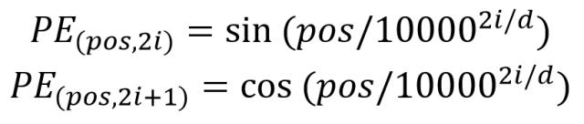

**如果你开始提问，那说明你开始进步了！**

    前言：一直有个困惑？看完了整个过程，具体是怎么是怎么实现翻译功能的？
    
    后知后觉的理解：一连串的变换矩阵变换，最终只是为了找到不同词库中的位置！

## 词的Embedding怎么表示的？

**简洁回答：使用训练模型得出一串向量！**

单词的 Embedding 有很多种方式可以获取，例如可以采用 Word2Vec、Glove 等算法预训练得到，也可以在 Transformer 中训练得到。举个例子

假设我们有一个句子：  

**"I love machine learning."**  

我们希望将其中的单词转换为向量表示（Embedding）。下面分别介绍三种方式：  

### **1. 使用 Word2Vec 获取单词 Embedding**  
Word2Vec 通过上下文关系学习单词的语义，通常有 **CBOW（Continuous Bag of Words）** 和 **Skip-gram** 两种方式。假设我们使用了 Word2Vec 训练的预训练模型：

- `Word2Vec("I") → [0.12, -0.45, 0.88, ...]`  
- `Word2Vec("love") → [-0.56, 0.77, -0.34, ...]`  
- `Word2Vec("machine") → [0.67, -0.12, 0.45, ...]`  
- `Word2Vec("learning") → [-0.23, 0.56, -0.78, ...]`  

这些向量是从大量文本中学习到的，可以用于 NLP 任务，比如情感分析、文本分类等。  

### **2. 使用 GloVe 获取单词 Embedding**  
GloVe（Global Vectors for Word Representation）基于词共现矩阵构建词向量，它关注整个文本语料中词与词的共现关系。例如：

- `GloVe("I") → [0.08, -0.34, 0.91, ...]`  
- `GloVe("love") → [-0.63, 0.80, -0.25, ...]`  
- `GloVe("machine") → [0.72, -0.10, 0.50, ...]`  
- `GloVe("learning") → [-0.18, 0.50, -0.65, ...]`  

GloVe 适用于静态的词向量训练，一旦训练完成，所有单词的表示不会随上下文变化。  

### **3. 使用 Transformer 训练得到单词 Embedding**  
在 Transformer 模型（如 BERT、GPT）中，单词 Embedding 是在 **自注意力机制** 的作用下动态生成的。例如，在 BERT 预训练模型中，我们可以将句子输入到 BERT 中，得到动态的单词表示：

- `BERT("I") → [0.10, -0.22, 0.75, ...]`  
- `BERT("love") → [-0.50, 0.70, -0.30, ...]`  
- `BERT("machine") → [0.65, -0.15, 0.40, ...]`  
- `BERT("learning") → [-0.20, 0.55, -0.70, ...]`  

与 Word2Vec 和 GloVe 不同，**BERT 生成的单词向量会根据上下文变化**，例如“bank”在“river bank”（河岸）和“bank account”（银行账户）中的表示会不同。  

**总结**：
- Word2Vec 和 GloVe 生成的词向量是固定的，适用于大部分 NLP 任务。  
- Transformer（如 BERT）生成的词向量是动态的，更适用于需要理解上下文的任务（如问答、文本生成）。
？
## 位置Embedding怎么表示？

**简介回答：公式计算**

假设我们有一个句子：  

**"I love NLP models."**  

Transformer 需要将这个句子转换为向量表示，其中包含单词的词向量（Word Embedding）和位置向量（Position Embedding）。假设我们使用 4 维的嵌入表示（为了简化示例），即每个单词的词向量和位置向量的维度均为 4。  

### **1. 计算单词的 Embedding（Word Embedding）**  
假设使用预训练的 Word2Vec 或 Transformer 训练得到的单词嵌入：  

- `Embedding("I") = [0.1, 0.3, 0.5, 0.7]`  
- `Embedding("love") = [0.2, 0.4, 0.6, 0.8]`  
- `Embedding("NLP") = [0.3, 0.5, 0.7, 0.9]`  
- `Embedding("models") = [0.4, 0.6, 0.8, 1.0]`  

### **2. 计算位置 Embedding（Position Embedding）**  
按照 Transformer 提出的正弦/余弦公式计算位置编码（这里只是示例，实际计算会更复杂）：  

假设：
- `pos = 0`（第一个单词 “I” 的位置），  
- `pos = 1`（第二个单词 “love” 的位置），  
- `pos = 2`（第三个单词 “NLP” 的位置），  
- `pos = 3`（第四个单词 “models” 的位置）。  

使用正弦和余弦函数计算的示例值（假设 4 维度 PE）：  

- `PE(0) = [sin(0), cos(0), sin(0/10000^(2/4)), cos(0/10000^(2/4))] = [0.0, 1.0, 0.0, 1.0]`  
- `PE(1) = [sin(1), cos(1), sin(1/10000^(2/4)), cos(1/10000^(2/4))] = [0.84, 0.54, 0.01, 0.99]`  
- `PE(2) = [sin(2), cos(2), sin(2/10000^(2/4)), cos(2/10000^(2/4))] = [0.91, -0.42, 0.02, 0.98]`  
- `PE(3) = [sin(3), cos(3), sin(3/10000^(2/4)), cos(3/10000^(2/4))] = [0.14, -0.99, 0.03, 0.97]`  

### **3. 计算最终的 Transformer 输入**  
将单词 Embedding 和位置 Embedding 相加，得到 Transformer 的输入向量：  

- `X("I") = [0.1, 0.3, 0.5, 0.7] + [0.0, 1.0, 0.0, 1.0] = [0.1, 1.3, 0.5, 1.7]`  
- `X("love") = [0.2, 0.4, 0.6, 0.8] + [0.84, 0.54, 0.01, 0.99] = [1.04, 0.94, 0.61, 1.79]`  
- `X("NLP") = [0.3, 0.5, 0.7, 0.9] + [0.91, -0.42, 0.02, 0.98] = [1.21, 0.08, 0.72, 1.88]`  
- `X("models") = [0.4, 0.6, 0.8, 1.0] + [0.14, -0.99, 0.03, 0.97] = [0.54, -0.39, 0.83, 1.97]`  

### **4. 解释**  
最终输入的向量 `X` 结合了单词的语义信息（Word Embedding）和单词在句子中的顺序信息（Position Embedding）。这样 Transformer 在处理时就可以利用这些信息进行有效的注意力计算。  

**总结**：
- **Word Embedding** 代表了单词的语义信息。  
- **Position Embedding** 通过正弦和余弦函数编码位置，使模型能感知单词的顺序。  
- **二者相加** 形成 Transformer 的输入，使得模型在不使用 RNN 的情况下仍然能捕捉句子结构信息。

## Encode是怎么工作的？

内部`Multi-Head Attention`，是由多个 `Self-Attention`组成的。一些列的矩阵变换最终得到C矩阵。

## 怎么得到C矩阵？

上一个问题实际已经回答。

## C矩阵的内部信息是什么样的?

经过特殊编码，且的维度和原始矩阵X一致的输入信息。

## Decode内部是怎么实现的？

两个`Multi-Head Attention`，第一个负责 `Masked`

## Masked怎么实现？

Mask矩阵，将数据掩盖。

## Attention 机制是什么

大概意思就是让Encoder编码出的c向量跟Decoder解码过程中的每一个输出进行加权运算，在解码的每一个过程中调整权重取到不一样的c向量，更通俗的讲就是c 就是包含“欢迎来北京”这句话的意思，翻译到第一个词“welcome”的时候，需要着重去看“欢迎”这个词

这里借用一个大佬说过的话：Attention听上去就是一个很屌，不明觉厉的东西，实际实现起来就是，哦原来是这么回事。总结一下吧，Attention机制就是让编码器编码出来的向量根据解码器要解码的东西动态变化的一种机制，貌似来源灵感就是人类视觉在看某一个东西的时候会有选择的针对重要的地方看。

[Seq2Seq模型介绍](https://zhuanlan.zhihu.com/p/194308943)

## reference

[Transformer模型详解（图解最完整版）](https://zhuanlan.zhihu.com/p/338817680)

[Transformer模型](https://mp.weixin.qq.com/s/WDq8tUpfiKHNC6y_8pgHoA)

[Transformer代码详解](https://zhuanlan.zhihu.com/p/403433120)

[神经网络算法 – 一文搞懂 Transformer（总体架构 & 三种注意力层）](https://www.baihezi.com/post/224153.html)