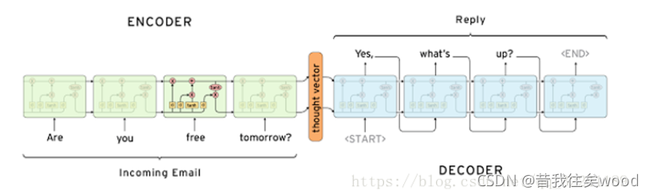

所谓Seq2Seq(Sequence to Sequence)，即序列到序列模型，就是一种能够根据给定的序列，通过特定的生成方法生成另一个序列的方法，同时这两个序列可以不等长。这种结构又叫Encoder-Decoder模型，即编码-解码模型，其是RNN的一个变种，为了解决RNN要求序列等长的问题。

**如果你开始提问，那说明你开始进步了！**

## Seq2Seq训练以及数据处理

就拿人机对话为例，我们输入一句话，机器输出对应回答的句子，处理方法如下：

（1）假设有10000个问答句作为训练样本，我们统计得到1000个互异的字和每个字出现的次数；

（2）根据统计得到的这1000个字，按照字数从多到少排序，即0-999结束，得到字典表；

（3）基于得到字典表，对问答句进行one-hot编码；

（4）由于编码难度较大且0多，我们进行embedding降维，得到特征矩阵；

（5）得到特征矩阵后就可以作为输入，然后预测时输出的值是分类个数为1000的分类器，哪个概率最大预测所得就是对应的哪个字。

## Reference
[学习笔记十四——Seq2Seq模型](https://blog.csdn.net/zhuge2017302307/article/details/119979892)
