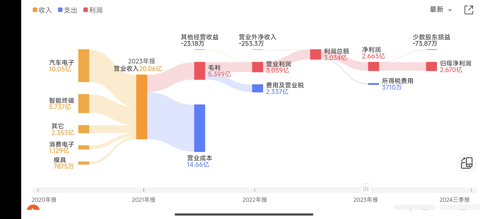
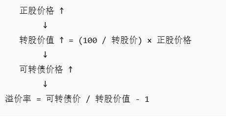

> Big Market决定了一家公司的上限。

## 评估一家公司质地的指标

### 归母净利润

归母净利润（归属于母公司股东的净利润，Net Profit Attributable to Parent Company）是企业财务报表中的一个关键指标，指的是企业在扣除所有成本、费用、税费后，最终归属于母公司股东的净利润。

 $$
\text{归母净利润} = \text{净利润} - \text{少数股东损益}
$$

其中：

净利润：企业的总利润扣除所得税后的最终利润。

少数股东损益：子公司中属于非母公司股东（少数股东）的部分利润。

    净利润:指企业在一定会计期间内，营业收入扣除营业成本、税费、各项费用、投资损益等后的最终利润，反映了企业的最终盈利水平。

### 负债率

$$ \text{负债率} = \frac{\text{总负债}}{\text{总资产}} \times 100\% $$

负债分有息负债与无息负债。有息负债指银行贷款可转债，发行债券等需要还本还息的借款。无息负债一般是指拖欠上下游的经营负债，要还本不用还息。当然如果公司足够强势，其实可以在资产负债表上形成一笔长期经营负债供公司使用。当然从我的角度出发，一切负债都是不稳定的因素。

比如在经营困难的时候，负债是会压倒骆驼的最后一根稻草。我喜欢选择一些低负债率帐面现金多的公司，哪怕公司今年没有一分钱营业收入，把上下游欠款和银行贷款一还，还能靠着资产负债表的现金，产生投资收益利息收入，这样利润表上面不会出现亏损，分红也能持续。这一点很关键，它可以避免股票因为亏损而出现st。哪怕出现最糟糕的情况，清算价值也能拿回70%本金。

流动比率也是一个衡量指标（流动资产/流动负债），这个指标可以反映企业的短期偿债能力，一般我喜欢这个指标大于2的企业。

## 可转债的几个条款

### 强赎
**目的：** 减少利息支出 + 完成股本扩张。

当股票涨得很高时，上市公司“强制要求”持有人把可转债转成股票（或以很低的价格赎回），让可转债尽快退出。

**条件：** 在本可转债存续期间，当公司股票在任意连续三十个交易日中有十五个交易日的收盘价格不低于当期转股价格的130%时，公司有权按照约定的强制赎回价格赎回全部或部分未转股的可转债。

例：
若转股价为 10 元，则强赎触发价 ≈ 13 元。

**强赎公告与时间：**    
1. 公告触发强赎条件——通知投资者
2. 给出转股期（通常 15～30 天）  
3. 到期未转股者将按强赎价被公司收回，所以强赎期间，投资人一般会选择 转股或卖出  

**核心影响：**
1. **公司角度**

    *   债转股，减少负债
    *   缓解利息压力
    *   股本扩大

2. **投资者角度**

    *   限制可转债继续上涨的空间（被强赎“封顶”）
    *   强赎公告后债价会接近强赎价
    *   最安全的做法是提前卖出或转股

满足强赎后为什么不发强赎条款 (https://mp.weixin.qq.com/s/Pj1VF6vwEBqVhyHmGD7n1)

### 回售

股价下跌太厉害，要求公司赎回转债。

### 下修

股价下跌太厉害，修改转股价值，将可转债的价格拉回到100面值左右。

## 可转债重要指标
### 转股价 

公司规定多少价格的股票，可以用 100 元面值的可转债换取。

*   **例如：** 转股价 = 10 元 $\to$ 100 元可转债可换 10 股。

### 转股价值 

假设把可转债转换成股票后，它的实际价值。

$$ \text{转股价值} = \frac{100}{\text{转股价}} \times \text{正股价} $$

*   **例如：** 转股价 10 元，正股价 15 元  
    $\to$ 转股价值 $= (100/10) \times 15 = 150$ 元

### 溢价率

可转债相对其可转股票价值的贵/便宜程度。

$$ \text{溢价率} = \frac{\text{可转债价格}}{\text{转股价值}} - 1 $$

*   **例如：** 可转债 130 元、转股价值 150 元
    $$ \text{溢价率} = \frac{130}{150} - 1 = -13.3\% $$

