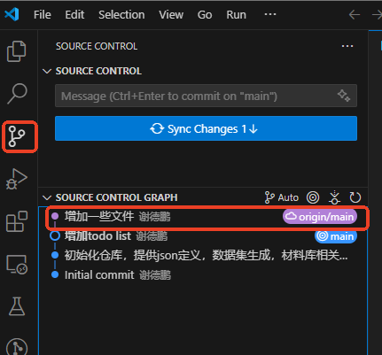
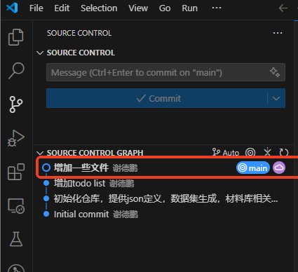
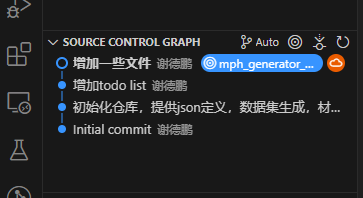
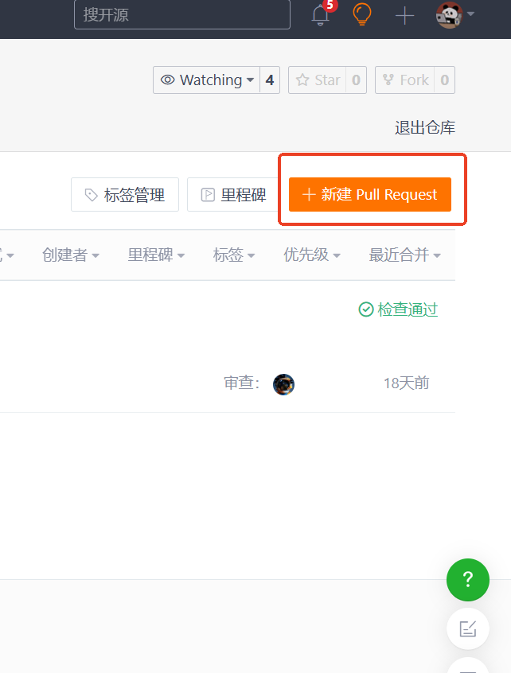
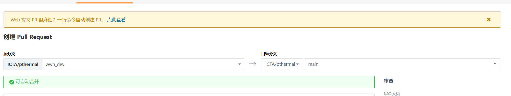
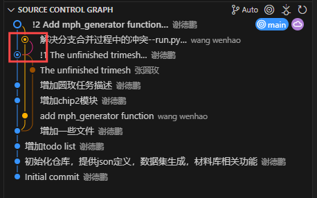

# git代码（基于实际开发流程）

ps:在vscode中可以可视化仓库的变化情况

ps:本文件主要使用命令行的形式，在vscode中可视化验证自己的操作是否正确

## 1. Clone代码

1. 假设已经将代码`clone`​到本地了

## 2. 拉取远程仓库最新代码

1. ​`git fetch`​拉取远程所有更新。

    ​​

    * 可以点击粉色节点查看变化内容。（这里不再使用git diff命令，可视化方便直观）

2. ​`git merge`​合并到当前分支

    ​​

## 3.提交代码

1. ​`git add .`​将修改存入暂存区（stage）
2. ​`git commit -m "备注信息"`​提交已经存入到stage的内容
3. ​`git push origin wwh_dev`​将本地的`wwh_dev`​分支，推送到`origin`​远端

‍

背景：在main分支开发完毕后，在没有commit的情况下，新建了分支mph_generator_dev当作是本次开发的备份，同样在没有commit的情况下，又新建了一个分支wwh_dev当作是提交分支。

warning：当我执行完`git push origin wwh_dev`​ 后，其他分支的内容都回到了修改前  
​​  
​​

error:猜想造成的原因是，创建其他分支之前没有`commit`​ 造成的。此想法还没有验证。（TODO）  
  
main分支没有commit的情况下新建了A分支，A分支git commit之后，main分支所有修改都消失了

‍

‍

‍

‍

## 4.向管理者提交pull requests

1. 在GUI页面中进行的。

    ​​

    ​​

源分支：开发完成的分支

目标分支：项目分支

2. 解决冲突

    在GUI界面上解决，并且在GUI界面，`git add .`​和`git commit -m "备注信息"`​

等待管理员接受PR,合并代码后，以此开发任务就完成了。

‍

### 4.1查看是否提交成功

背景：在wwh_dev分支上开发，提交代码后，merge之后，想在其他分支看我提交的内容，同时保证一个分支时刻保持最新。问题来了。在Thermal5.0（想要保持最新的分支）看不到我提交的内容。

原因在于没有进行分支追踪：  
执行 `git pull <远程> <分支>`​     例如：git pull origin Thermal5.0  
执行之后，即可得到最新提交代码

### 4.2 添加分支跟踪

手动：

​`git branch --set-upstream-to=<remote_name>/<remote_branch> <branch_name>`​

‍

新建分支的时候建立追踪关系：

​`git checkout -b my_branch origin/develop`​

​`git switch -c my_branch origin/develop`​

‍

### 4.3 查看跟踪分支

‍

git branch -vv

‍

‍

‍

## 5. 再开启一个新开发任务

1. 分支分配

    1. ​`main`​分支，保持和origin远端的同步，不要在这个上面开发
    2. ​`dev`​分支，每次最新任务的开发分支
    3. ​`dev_xx_backup`​分支，开发完一个任务后的备份，拷贝来自`dev`​分支，包含任务测试代码
2. 分支管理

    1. 每次`push`​提交后，等待管理员检查无误后，将`dev`​分支删除
    2. 保证`main`​分支最新，从`main`​分支中新建一个分支当成当前任务的分支
    3. 此时`branch`​结构中只包含，一个`main`​分支，一个`dev`​分支，和`每次任务的备份`​分支

‍

## 6.SOURCE CONTROL GRAPH

ps：图片都来自`vscode`​

1. 来自于`git fetch`​之后

    ​​

    解释：  

    1. 每一个实心圆代表每一次提交节点
    2. 不同颜色的线，表示不同开发人员的开发路线
    3. 蓝色空心圆表示当前所在的节点
    4. 圆环表示合并操作

2. 来自`git merge`​之后

    ​​

    1. 框中标注的部分，当时是在GUI界面上修改分支冲突的，所以会从蓝色线程中分出一个分支到橙色线程的合并

‍

‍

‍

