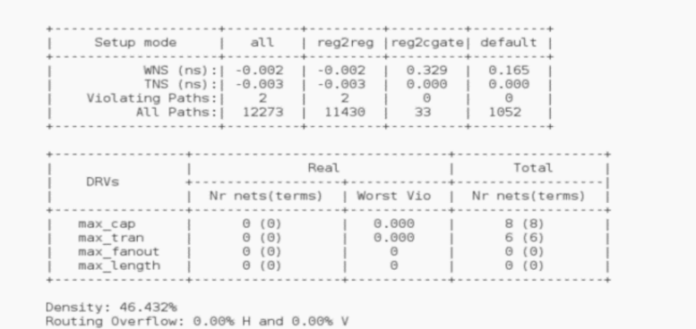

## 原理图->芯片物理版图
根据电路设计图（也称为原理图或HDL代码）生成芯片物理版图
### 逻辑综合
这是将电路设计图转换为门级网表的过程，门级网表是由基本逻辑门（如与门、或门、非门等）和触发器（如D触发器、JK触发器等）组成的电路结构，它可以反映电路设计图的功能和性能。逻辑综合需要设定约束条件，就是希望综合出来的电路在面积、时序等目标参数上达到的标准；逻辑综合还需要指定基于的库，使用不同的综合库，在时序和面积上会有差异。常用的逻辑综合工具有Synopsys的Design Compiler，Cadence的PKS，Synplicity的Synplify等。
### 布局规划
这是在确定芯片的总体尺寸和形状后，将芯片中的各个模块（如IP核、存储器、I/O引脚等）分配到合适的位置的过程，布局规划需要考虑各个模块之间的连接关系、信号延迟、功耗分布、热效应等因素，以优化芯片的性能和可靠性。布局规划后，芯片的大小，Core的面积，Row的形式、电源及地线的Ring和Strip都确定下来了。常用的布局规划工具有Cadence的Encounter/Innovus，Synopsys的ICC等。
### 时钟树综合
这是在布局规划后，对芯片中的时钟信号进行专门的布线设计的过程，时钟信号在数字芯片中起着全局指挥作用，它需要对称地分配到各个寄存器单元，以保证时钟从同一个时钟源到达各个寄存器时，时钟延迟差异最小。时钟树综合需要考虑时钟频率、抖动、偏移等因素，以提高芯片的时序性能。常用的时钟树综合工具有Cadence Encounter/Innovus, Synopsys ICC, Synopsys PrimeTime SI等。

### 布局布线
这是将门级网表转换为具体的物理版图的过程，包括标准单元（如基本逻辑门电路）的放置和各种层之间的走线。布局布线需要遵循特定工艺的设计规则（如最小宽度、最小间距等），以保证版图可以被正确地加工出来。布局布线还需要考虑面积、功耗、时序、噪声、串扰等因素，以优化芯片的质量和效率。常用的布局布线工具有Cadence Encounter/Innovus, Synopsys ICC, Synopsys Astro等。
### 物理验证
这是在完成物理版图后，对其进行检查和修正的过程
#### 设计规则检查（DRC）
这是检查物理版图是否符合工艺设计规则的过程，如果发现任何违反规则的地方，就需要进行修改。常用的设计规则检查工具有Synopsys的Hercules/ICV，Cadence的Assura/PVS，Mentor的Calibre等。
#### 布局与网表比较（LVS）
这是检查物理版图是否与门级网表在功能上完全一致的过程，如果发现任何不匹配或缺失的地方，就需要进行调整。常用的布局与网表比较工具有Synopsys的Hercules/ICV，Cadence的Assura/PVS，Mentor的Calibre等。
#### 寄生参数提取（PEX）
这是从物理版图中提取出电阻、电容、电感等寄生参数的过程，这些参数会影响电路的性能和信号完整性，需要进行后仿真和分析。常用的寄生参数提取工具有Synopsys的Star-RC, Cadence的QRC, Mentor的Calibre XRC等。
#### 时序验证（STA）
这是基于寄生参数提取的结果，对电路的时序性能进行验证的过程，主要检查电路是否存在建立时间（setup time）和保持时间（hold time）的违例，如果发现任何时序问题，就需要进行优化。常用的时序验证工具有Synopsys的PrimeTime, Cadence’s Tempus等。
#### 信号完整性分析（SI）
这是基于寄生参数提取的结果，对电路的信号质量进行分析的过程，主要检查电路是否存在噪声、串扰、反射等问题，如果发现任何信号完整性问题，就需要进行改善。常用的信号完整性分析工具有Synopsys PrimeTime SI, Cadence Sigrity, Ansys Totem/Redhawk等。

物理版图验证完成后，就可以将GDSII文件交给芯片代工厂（称为Foundry），在晶圆硅片上通过多道工艺步骤（如光刻、刻蚀、离子注入、沉积等）实现芯片的制造，再进行封装和测试，就得到了我们实际看见的芯片。

[一些芯片设计的冷知识](https://blog.csdn.net/Jailman/article/details/132761728)

## 芯片键合（bonding）
这个博主的其他文章也值得一看《傻白入门芯片设计系列》

[傻白入门芯片设计，芯片键合(Die Bonding)（四）](https://blog.csdn.net/qq_46675545/article/details/128050411)

[傻白入门芯片设计，典型的2D/2D+/2.5D/3D封装技术（六）](https://blog.csdn.net/qq_46675545/article/details/128053478)

[傻白入门芯片设计，如何降低CPU功耗？（八）](https://blog.csdn.net/qq_46675545/article/details/128076797)

## 为什么还需要interposer层级
1. bump的大小是否符合和芯片I/O要求
2. bump影响寄生参数值（根据电阻电感电容的公式推理即可. [Bump 越大，寄生电阻和寄生电感越小，但寄生电容越大。]
3. 更加灵活的互联（更短的互联路径）

## 4D芯片集成
[芯片的先进封装会发展到4D吗？](https://www.eet-china.com/mp/a352641.html)

## DRAM预充电的作用
预充电操作是为了“清空现场、重置电压”，以便 DRAM 可以正确执行下一次读写操作

1. DRAM 的位线是差分信号线，感应放大器是通过对微小电压差放大来判断是 0 还是 1 的。如果前一次操作后电压还残留，就会影响下一次数据的正确性。

预充电 = 把位线电压“归一化”到 ½ 电压，为下次判别提供基准。不偏向 0，也不偏向 1

| 状态 | cell 电容 | 位线电压 | 连接后 | 差值 | 放大结果 |
|------|------------|-----------|----------|--------|------------|
| 存1  | Vdd        | Vdd/2     | 位线稍↑  | +ΔV   | 判为 1     |
| 存0  | 0V         | Vdd/2     | 位线稍↓  | -ΔV   | 判为 0     |

也就是说，cell 的电压通过连接到“Vdd/2”的位线上，形成一个微小的正/负波动，这时 Sense Amplifier 就可以把这个波动“放大”成逻辑 1 或 0。

2. 感应放大器只对微小差异敏感。若位线未被预充电，数据对比将发生偏移，导致：

数据判别错误（读取出错）

写入扰动（错误写入别的单元）

[傻白入门芯片设计，史上最最最全DRAM介绍](https://blog.csdn.net/qq_46675545/article/details/128210207)

[【DC】逻辑综合基础](https://blog.csdn.net/Tranquil_ovo/article/details/129876980)

## LC谐振
电容，电感，反复充放电。
[还搞不懂 LC振荡电路原理？看这一文就够了，图文结合，立马带你搞定](https://zhuanlan.zhihu.com/p/532163425)

##  正片和负片
[PCB正片和负片的区别与使用](https://blog.csdn.net/weixin_42837669/article/details/110411765)

## Allegro加密文件密码破解和解除读写导出限制
[Allegro加密文件密码破解和解除读写导出限制](https://blog.csdn.net/vanfone/article/details/116275609)

## 静态时序分析（STA）报告摘要

这张图展示的是数字后端设计中关键的 **静态时序分析（STA）报告摘要** 和 **设计规则违规（DRV）检查统计**，以下是详细解读：

---

### 📍**1. Setup Mode 时序分析表**

这部分列出了多种 **路径类别（setup mode）** 的时序结果：

| 字段                | 含义                                  | 备注                                                    |
| ----------------- | ----------------------------------- | ----------------------------------------------------- |
| `WNS (ns)`        | Worst Negative Slack，最差路径的负裕量（最坏延迟） | - 值为负数时说明时序违例。 - `all` 模式下为 `-0.002ns`，说明有轻微的时序违例。 |
| `TNS (ns)`        | Total Negative Slack，总的时序违例之和       | 所有违反路径加总的延迟量。`-0.003ns` 是非常轻微的问题。                     |
| `Violating Paths` | 时序违例路径数                             | `all` 模式下有 2 条路径违例                                    |
| `All Paths`       | 总路径数                                | 全设计共 12,273 条路径（时序分析覆盖）                               |

🔍 各模式说明：

* `reg2reg`: 从寄存器到寄存器的路径（主路径）
* `reg2cgate`: 从寄存器到组合逻辑门（用于分析组合部分）
* `default`: 默认路径类别
* `all`: 总体视角

---

### 📍**2. DRVs：Design Rule Violations 设计规则违规统计**

这一部分列出的是违反电气规则（例如上限/转换时间等）的信息。

| DRV 类型       | 含义         | 结果解读                                                     |
| ------------ | ---------- | -------------------------------------------------------- |
| `max_cap`    | 最大负载电容违例   | 共检测到 8 条网络超出上限（8 个实例），但**没有真实违例值**（Worst Vio = 0），可能已修复。 |
| `max_tran`   | 最大信号转换时间违例 | 检测到 6 条网络；Worst Vio 为 0.000，说明也已修复。                      |
| `max_fanout` | 最大扇出       | 0                                                        |
| `max_length` | 最大线长       | 0                                                        |

📝 注：Real vs Total 表示是否是“实际有效违规”

* Real：当前设计中真实存在的；
* Total：工具设置阈值检测到的超限数（可能已修复或忽略）。

---

### 📍**3. Density & Routing Overflow**

* **Density**: `46.432%`
  → 标准单元填充密度，不高，布线空间充足。

* **Routing Overflow**: `0.00% H and 0.00% V`
  → 布线拥塞情况非常理想，无水平或垂直溢出，说明布线非常顺畅。

---

### ✅ 总结

| 分类        | 结论                               |
| --------- | -------------------------------- |
| 时序（STA）   | 有轻微负 slack（-0.003ns），可继续优化，未严重超时 |
| 设计规则（DRV） | 所有电气规则违例已修复，0 违规                 |
| 布局密度      | 46%，空间富余                         |
| 布线拥塞      | 0%，极佳                            |

---

如你需要，我可以提供一些优化建议来消除 WNS/TNS。是否需要我帮你写个时序优化建议脚本或时序debug checklist？

## SPEF文件
SPEF（Standard Parasitic Exchange Format）文件是一种 标准电路寄生参数交换文件，用于描述芯片设计中 电路的寄生参数信息，如：

寄生电容（capacitance）

寄生电阻（resistance）

电感（如有）

这些寄生参数主要来自于布线和互连，会影响信号延迟和电路时序，是时序分析（STA）和信号完整性分析（SI）不可或缺的数据源。

## CS中的前后端和IC中的前后端区别
这是个非常好的问题，很多初学者都会混淆“前端/后端”在 **计算机科学（CS）** 和 **数字IC设计** 这两个领域中的含义。以下是详细对比说明：

---

### 🧠 一、**计算机科学（CS）中的前端与后端**

这是你在 Web 开发、软件工程等方向常听到的：

| 维度  | 前端（Frontend）                    | 后端（Backend）                       |
| --- | ------------------------------- | --------------------------------- |
| 定义  | 用户直接交互的部分                       | 处理逻辑、数据库、服务器的部分                   |
| 内容  | HTML、CSS、JavaScript、React、Vue 等 | Java、Python、Node.js、数据库、API、服务器逻辑 |
| 示例  | 页面按钮、表单、界面动画                    | 用户登录验证、数据存取、接口开发                  |
| 技能栈 | Web UI、响应式设计、DOM 操作             | API 设计、数据库设计、系统架构、权限控制            |

✅ **本质：前端关注“用户体验”，后端关注“数据与逻辑处理”。**

---

### 🔧 二、**数字IC设计中的前端与后端**

这是在芯片设计（如 SoC、CPU）中使用的：

| 维度 | 前端设计（Frontend Design）                                  | 后端设计（Backend Design）                                                        |
| -- | ------------------------------------------------------ | --------------------------------------------------------------------------- |
| 定义 | 描述电路功能逻辑                                               | 实现功能的物理版图布局                                                                 |
| 内容 | RTL 编写（Verilog/VHDL）、仿真、综合、形式验证                        | 布图布局（place & route）、时序收敛、DRC/LVS、RC提取                                       |
| 工具 | ModelSim, VCS, DC（Design Compiler）等                    | Innovus, ICC2, Calibre, StarRC 等                                            |
| 阶段 | - RTL Coding - Functional Simulation - Synthesis | - Floorplan - Placement - CTS - Routing - DRC/LVS - GDSII 生成 |

✅ **本质：前端构建“逻辑电路”，后端实现“物理电路”。**

---

### 🧩 总结对比：CS vs 数字IC

| 维度   | CS领域                   | 数字IC设计                    |
| ---- | ---------------------- | ------------------------- |
| 前端   | 用户界面、网页端               | RTL/功能设计                  |
| 后端   | 数据逻辑、服务器               | 物理实现、布图布线                 |
| 工具语言 | JS, HTML, Python, Java | Verilog, VHDL, Tcl, EDA工具 |

---

