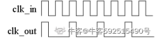
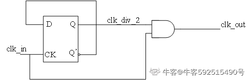

## 前端

## 验证

## 后端
### URL
[牛客———【数字IC后端岗】校招笔试如何准备？](https://www.nowcoder.com/discuss/353158032005734400)

### 1、什么是天线效应？如何修复？【华为海思】
（生产过程中）由于等离子刻蚀法使金属刻蚀过程中收集大量空间静电电荷，当金属积累的静电电荷超过一定数量，形成的电势超过它所接连门栅所能承受的击穿电压时，晶体管就会被击穿，导致器件损坏，这就是天线效应。

在芯片生产过程中，暴露的金属线或者多晶硅（polysilicon）等导体，就象是一根根天线，会收集电荷（如等离子刻蚀产生的带电粒子）导致电位升高。天线越长，收集的电荷也就越多，电压就越高。若这片导体碰巧只接了MOS 的栅，那么高电压就可能把薄栅氧化层击穿，使电路失效，这种现象我们称之为“天线效应”。

修复的方法:核心原理，释放天线上的电荷。  
[天线效应产生原因及解决办法](https://blog.csdn.net/qq_38328278/article/details/118544550#:~:text=%E4%B8%89%E3%80%81%E8%A7%A3%E5%86%B3%E5%8A%9E%E6%B3%95%20*%203.1%20%E8%B7%B3%E7%BA%BF%E6%B3%95%20%E5%B0%86%E6%9C%89%E5%A4%A9%E7%BA%BF%E6%95%88%E5%BA%94%E7%9A%84%E9%87%91%E5%B1%9E%E7%BA%BF%E6%89%93%E6%96%AD%EF%BC%8C%E9%80%9A%E8%BF%87%E9%80%9A%E5%AD%94%E5%90%91%E4%B8%8A%E6%88%96%E5%90%91%E4%B8%8B%EF%BC%8C%E5%86%8D%E9%80%9A%E8%BF%87%E9%80%9A%E5%AD%94%E5%9B%9E%E5%88%B0%E8%AF%A5%E5%B1%82%E3%80%82%20%E8%B7%B3%E7%BA%BF%E7%BC%A9%E5%B0%8F%E4%BA%86%E9%87%91%E5%B1%9E%E8%BF%9E%E7%BA%BF%E7%9A%84%E9%95%BF%E5%BA%A6%EF%BC%8C%E5%9B%A0%E8%80%8C%E8%B5%B7%E5%88%B0%E5%87%8F%E5%B0%8F%E5%A4%A9%E7%BA%BF%E6%95%88%E5%BA%94%E7%9A%84%E4%BD%9C%E7%94%A8%E3%80%82%20%E4%BD%86%E9%80%9A%E5%AD%94%E7%9A%84%E7%94%B5%E9%98%BB%E8%BE%83%E5%A4%A7%EF%BC%8C%E4%BC%9A%E5%BD%B1%E5%93%8D%E8%8A%AF%E7%89%87%E7%9A%84%E6%97%B6%E5%BA%8F%EF%BC%8C%E5%B9%B6%E4%B8%94%E5%8F%AF%E8%83%BD%E5%9C%A8%E5%85%B6%E4%BB%96%E5%B1%82%E5%B8%A6%E6%9D%A5%E4%B8%B2%E6%89%B0%E7%9A%84%E5%BD%B1%E5%93%8D%E3%80%82,%E7%A7%91%E5%AD%A6%E5%90%88%E7%90%86%E7%9A%84PCB%E8%AE%BE%E8%AE%A1%E9%9C%80%E4%BB%8E%E7%94%B5%E6%BA%90%E6%8E%A7%E5%88%B6%E5%85%A5%E6%89%8B%EF%BC%8C%E7%A1%AE%E4%BF%9D%E5%9B%9E%E6%B5%81%E8%B7%AF%E5%BE%84%E4%BC%98%E5%8C%96%EF%BC%8C%E6%89%8D%E8%83%BD%E5%AE%9E%E7%8E%B0%E9%AB%98%E5%8F%AF%E9%9D%A0%E6%B7%B7%E5%90%88%E4%BF%A1%E5%8F%B7%E7%B3%BB%E7%BB%9F%E3%80%82%20%E7%BB%A7%E7%BB%AD%E8%AE%BF%E9%97%AE%20%E5%A4%A9%E7%BA%BF%E6%95%88%E5%BA%94%E7%9A%84%E4%BA%A7%E7%94%9F%E6%9C%BA%E7%90%86%E5%8F%8A%E6%B6%88%E9%99%A4%E6%96%B9%E6%B3%95%20%E5%AF%BC%E8%AF%BB%EF%BC%9A%E9%9A%8F%E7%9D%80%E5%B7%A5%E8%89%BA%E6%8A%80%E6%9C%AF%E7%9A%84%E5%8F%91%E5%B1%95%EF%BC%8C%E6%A0%85%E7%9A%84%E5%B0%BA%E5%AF%B8%E8%B6%8A%E6%9D%A5%E8%B6%8A%E5%B0%8F%EF%BC%8C%E9%87%91%E5%B1%9E%E7%9A%84%E5%B1%82%E6%95%B0%E8%B6%8A%E6%9D%A5%E8%B6%8A%E5%A4%9A%EF%BC%8C%E5%8F%91%E7%94%9F%E5%A4%A9%E7%BA%BF%E6%95%88%E5%BA%94%E7%9A%84%E5%8F%AF%E8%83%BD%E6%80%A7%E5%B0%B1%E8%B6%8A%E5%A4%A7%E3%80%82%20%E8%80%8C%E5%A4%A9%E7%BA%BF%E6%95%88%E5%BA%94%E5%88%99%E4%BC%9A%E5%AF%B9%E5%B0%8F%E5%9E%8B%E6%8A%80%E6%9C%AF%E9%A2%86%E5%9F%9F%E4%BA%A7%E7%94%9F%E9%9D%9E%E5%B8%B8%E5%A4%A7%E7%9A%84%E5%BD%B1%E5%93%8D%EF%BC%8C%E5%9B%A0%E4%B8%BA%E6%B3%84%E7%94%B5%E6%89%80%E5%B8%A6%E6%9D%A5%E7%9A%84%E6%8D%9F%E5%AE%B3%E5%BE%88%E5%8F%AF%E8%83%BD%E6%B3%A2%E5%8F%8A%E6%95%B4%E4%B8%AA%E6%A0%85%E6%9E%81%E3%80%82%20%E5%9B%A0%E6%AD%A4%EF%BC%8C%E6%9C%AC%E6%96%87%E5%AF%B9%E5%A4%A9%E7%BA%BF%E6%95%88%E5%BA%94%E7%9A%84%E4%BA%A7%E7%94%9F%E6%9C%BA%E7%90%86%E5%8F%8A%E6%B6%88%E9%99%A4%E5%A4%A9%E7%BA%BF%E6%95%88%E5%BA%94%E7%9A%84%E6%96%B9%E6%B3%95%E5%81%9A%E5%87%BA%E4%BA%86%E8%AE%A8%E8%AE%BA%E3%80%82%201.%E5%A4%A9%E7%BA%BF%E6%95%88%E5%BA%94%E7%AE%80%E5%8D%95%E4%BB%8B%E7%BB%8D%E5%A4%A9%E7%BA%BF%E6%95%88%E5%BA%94%E6%88%96%E7%AD%89%E7%A6%BB%E5%AD%90%E5%AF%BC%E8%87%B4%E6%A0%85%E6%B0%A7%E6%8D%9F%E4%BC%A4%E6%98%AF%E6%8C%87%EF%BC%9A%E5%9C%A8MOS%E9%9B%86%E6%88%90%E7%94%B5%E8%B7%AF%E7%94%9F%E4%BA%A7%E8%BF%87%E7%A8%8B%E4%B8%AD%EF%BC%8C%E4%B8%80%E7%A7%8D%E5%8F%AF%E6%BD%9C%E5%9C%A8%E5%BD%B1%E5%93%8D%E4%BA%A7%E5%93%81%E4%BA%A7%E9%87%8F%E5%92%8C%E5%8F%AF%E9%9D%A0%E6%80%A7%E7%9A%84%E6%95%88%E5%BA%94%E3%80%82)

（1）插入Diode二极管（保护二极管，反偏二极管）；
原理:在有天线效应的金属线上插入一个反向偏置的二极管。当金属线上积累的电荷达到一定程度时，二极管会导通(>0.7v)，形成到地的通路，从而释放积累的电荷，减少天线效应。  

优点:可以有效抑制电荷积累，降低天线效应。  
缺点:增加了芯片面积，不适用于大规模集成电路。

（2）向上跳线法  
原理：跳线法通过打断有天线效应的金属线，然后通过通孔将其连接到其他金属层，再回到原层，以此来改变金属布线的长度和路径，从而降低天线效应。  
类型：跳线法主要分为向上跳线和向下跳线两种方式。向上跳线是将金属线连接到天线层上一层，向下跳线则连接到下一层。

优点:相对简单，容易实现。  
缺点:通孔会增加电阻，可能影响芯片的时序和串扰问题。

（3）size up cell  
原理：增加 cell 的栅极面积（denominator 增大）→ 减小天线比  
通过将原先的 cell 替换为更大版本的 cell（比如从 NAND2_X1 换成 NAND2_X4）：

$ \text{Antenna Ratio} = \frac{\text{未连接金属的面积}}{\text{栅极面积}} $

栅极面积增加（例如变成原来的 2 倍或 4 倍）；

天线比自然降低，可能就会小于工艺允许的最大值；

这样就避免了额外插入天线二极管、或断线、或插入 buffer 的复杂处理。

### 2、芯片tapeout前要做哪些检查？【华为海思】
时序（setup/hold）检查，后仿，DRC/LVS，电气规则检查ERC，DFM（可制造性设计），LEC（等价性检查）

点击展开所有详细信息

✅ 1. 时序检查（Setup/Hold）

目的：确保芯片在工作频率下功能正确，不发生时序错误。

• Setup 检查：确保数据在时钟边沿到来前已稳定，满足 最小建立时间 要求。  
• Hold 检查：确保数据在时钟边沿后仍保持足够时间不变，满足 保持时间 要求。  
• 采用 STA 工具（如 PrimeTime），在多个 PVT（工艺、供电、温度）条件下验证时序。  
• 执行 OCV、cross corner 分析及多模多库（MMMC）分析，增强时序可靠性。

────────────────────────

✅ 2. 后仿（Gate-level simulation with SDF）

目的：验证综合、布局布线后，在真实延迟条件下芯片功能是否正确。

• 生成 post-layout netlist 和时延文件（SDF）后执行门级仿真。  
• 验证异步复位、锁存器、启动序列、扫描链、低功耗控制等关键功能。  
• 检查 glitch、亚稳态及不可预测状态。  
• 包括 scan chain、ATPG 模式及功能全覆盖仿真。

────────────────────────

✅ 3. DRC（Design Rule Check）设计规则检查

目的：确保芯片物理布局满足 Foundry 提供的制造工艺设计规则。

• 检查项目：金属宽度、间距、过孔密度、器件间隔、TSV/Pad 限制等。  
• 通过 PDK 中的规则文件和工具（如 Calibre、IC Validator）自动检查。  
• 所有 DRC 错误必须 100% 修复，才能提交流片申请。

────────────────────────

✅ 4. LVS（Layout Versus Schematic）版图与原理图对比

目的：确保最终版图与 RTL 描述的功能一致。

• 核对版图中每个晶体管及连接是否与 netlist 匹配。  
• 避免误连、漏连和短接等错误。  
• 工具有 Calibre LVS 和 PVS LVS。  
• ECO 修改后需重新进行 LVS 校验。

────────────────────────

✅ 5. ERC（Electrical Rule Check）电气规则检查

目的：捕捉常见电气错误，如浮空输入、短路和电压兼容性问题。

• 常见检查：  
  – 输入未驱动或浮空；  
  – 电源与地的短接；  
  – 跨电压域连接（需使用隔离 cell）；  
  – IO 驱动中的电压不匹配。  
• 对低功耗设计（多电压/多电源域）尤为重要。  
• 常用工具包括 Calibre ERC 和 Synopsys IC Validator。

────────────────────────

✅ 6. DFM（Design for Manufacturability）可制造性检查

目的：提升芯片良率和生产可控性，预防制造缺陷。

• 包含检查：  
  – 密度检查（metal density / slotting）；  
  – 填充检查（dummy fill）；  
  – 边缘放置错误；  
  – 光刻热点检测。  
• 根据 DFM 报告，工厂会反馈是否需要调整设计。

────────────────────────

✅ 7. LEC（Logic Equivalence Check）等价性检查

目的：确保综合后的 gate-level netlist 与 RTL 功能完全等价。

• 检查流程：  
  – 比较 RTL（黄金模型）和 gate-level netlist（目标模型）的输入、输出及逻辑路径。  
• 应用于综合后验证、ECO 及 Scan 插入后验证。  
• 常用工具：Cadence Conformal、Synopsys Formality。

────────────────────────

补充性检查

检查项              说明  
────────────────────────  
IR Drop 分析       检查供电网络是否存在过大的电压下降，防止功能异常。  
EM（电迁移）分析   检查金属线因电流过大而可能出现的迁移问题。  
Crosstalk / SI 分析 分析耦合电容引起的时序干扰。  
Antenna Check      检查天线效应，判断是否需要增加 diode 或断开连接。  
Package/IO Check   验证 IO 电压、电流是否符合 Pad 规则以及电源完整性。

────────────────────────

总结

华为海思等先进芯片设计公司在 Tapeout 前必须确保以下几点：  
功能正确（LEC、后仿） + 时序正确（STA） + 物理可靠（DRC/LVS/ERC/DFM） + 电气完整（IR Drop、EM、SI） + 制造可行（DFM）。

缺一不可，否则可能导致芯片白流（白片）和巨额损失。如果在流程中的任何工具或步骤遇到问题，请提供具体日志或报错信息，以便进一步分析解决。

### 3、闩锁效应是什么，怎么产生如何解决？【格科微】

闩锁效应是CMOS工艺所特有的寄生效应，是指在芯片的电源和地之间存在一个低阻抗的通路，产生很大的电流，导致电路无法正常工作，甚至烧毁电路。严重会导致电路的失效，甚至烧毁芯片。闩锁效应是由NMOS的有源区、P衬底、N阱、PMOS的有源区构成的n-p-n-p结构产生的，当其中一个三极管正偏时，就会构成正反馈形成闩锁。避免闩锁的方法就是要减小衬底和N阱的寄生电阻，使寄生的三极管不会处于正偏状态

### 4、前后端的整个flow，以及每一个步骤中会用到的工具【芯原】
前端：
（1）规格制定
芯片规格，也就像功能列表一样，是客户向芯片设计公司（称为 Fabless，无晶圆设计公司）提出的设计要求，包括芯片需要达到的具体功能和性能方面的要求。
（2）详细设计
Fabless根据客户提出的规格要求，拿出设计解决方案和具体实现架构，划分模块功能。

（3）HDL编码
使用硬件描述语言（VHDL，Verilog HDL，业界公司一般都是使用后者）将模块功能以代码来描述实现，也就是将实际的硬件电路功能通过 HDL语言描述出来，形成 RTL（寄存器传输级）代码。

（4）仿真验证
仿真验证就是检验编码设计的正确性，检验的标准就是（1）中制定的规格。看设计是否精确地满足了规格中的所有要求。规格是设计正确与否的黄金标准，一切违反，不符合规格要求的，就需要重新修改设计和编码。设计和仿真验证是反复迭代的过程，直到验证结果显示完全符合规格标准。
仿真验证工具 Synopsys 的VCS，还有Cadence的NC-Verilog。

（5）逻辑综合――Design Compiler
仿真验证通过，进行逻辑综合。逻辑综合的结果就是把设计实现的 HDL代码翻译成门级网表 netlist。综合需要设定约束条件，就是你希望综合出来的电路在面积，时序等目标参数上达到的标准。逻辑综合需要基于特定的综合库，不同的库中，门电路基本标准单元（standard cell）的面积，时序参数是不一样的。所以，选用的综合库不一样，综合出来的电路在时序，面积上是有差异的。 一般来说，综合完成后需要再次做仿真验证（这个也称为后仿真，之前的称为前仿真）
逻辑综合工具 Synopsys 的 Design Compiler。

（6）STA
Static Timing Analysis（STA），静态时序分析，这也属于验证范畴，它主要是在时序上对电路进行验证，检查电路是否存在建立时间（setup time）和保持时间（hold time）的违例（violation） 。这个是数字电路基础知识，一个寄存器出现这两个时序违例时，是没有办法正确采样数据和输出数据的，所以以寄存器为基础的数字芯片功能肯定会出现问题。
STA工具有Synopsys 的Prime Time。

（7）形式验证
这也是验证范畴，它是从功能上（STA 是时序上）对综合后的网表进行验证。常用的就是等价性检查方法，以功能验证后的 HDL 设计为参考，对比综合后的网表功能，他们是否在功能上存在等价性。这样做是为了保证在逻辑综合过程中没有改变原先 HDL描述的电路功能。
形式验证工具有 Synopsys 的Formality。

前端设计的流程暂时写到这里。从设计程度上来讲，前端设计的结果就是得到了芯片的门级网表电路。

后端：
（1）DFT
Design For Test，可测性设计。芯片内部往往都自带测试电路，DFT的目的就是在设计的时候就考虑将来的测试。DFT的常见方法就是，在设计中插入扫描链，将非扫描单元（如寄存器）变为扫描单元。关于 DFT，有些书上有详细介绍，对照图片就好理解一点。 DFT
工具 Synopsys 的DFT Compiler

（2）布局规划(FloorPlan)
布局规划就是放置芯片的宏单元模块，在总体上确定各种功能电路的摆放位置，如 IP模块，RAM，I/O引脚等等。布局规划能直接影响芯片最终的面积。

（3）CTS
Clock Tree Synthesis，时钟树综合，简单点说就是时钟的布线。由于时钟信号在数字芯片的全局指挥作用，它的分布应该是对称式的连到各个寄存器单元，从而使时钟从同一个时钟源到达各个寄存器时，时钟延迟差异最小。这也是为什么时钟信号需要单独布线的原因。

（4）布线(Place & Route)
这里的布线就是普通信号布线了，包括各种标准单元（基本逻辑门电路）之间的走线。比如我们平常听到的 0.13um 工艺，或者说 90nm 工艺，实际上就是这里金属布线可以达到的最小宽度，从微观上看就是MOS管的沟道长度。
2-4的工具有Synopsys的ICC/ICC2和Cadence的Innovus

（5）版图物理验证
对完成布线的物理版图进行功能和时序上的验证，验证项目很多，如 LVS（Layout Vs Schematic）验证，简单说，就是版图与逻辑综合后的门级电路图的对比验证；DRC（Design Rule Checking） ：设计规则检查，检查连线间距，连线宽度等是否满足工艺要求ERC（Electrical Rule Checking） ：电气规则检查，检查短路和开路等电气 规则违例；等等。
工具为Mentor的calibre

（6）寄生参数提取
由于导线本身存在的电阻，相邻导线之间的互感,耦合电容在芯片内部会产生信号噪声，串扰和反射。这些效应会产生信号完整性问题，导致信号电压波动和变化，如果严重就会导致信号失真错误。提取寄生参数进行再次的分析验证，分析信号完整性问题是非常重要的。
工具 Synopsys的 Star-RCXT。
（7） STA
（8） post-simulation(前仿是功能仿真，后仿真需要考虑门和线延迟)，动态时序仿真，是对加入了延时信息的网表文件进行的仿真，目的是验证时序以及功能都正确。它主要应用在异步逻辑、多周期路径、错误路径的验证中。需要布局布线后生成的网表文件.v和SDF文件.sdf。

点击展开所有详细信息

前端和后端设计流程是芯片设计（特别是数字IC）的两个主要阶段。以下是整个 flow 的详细分解，并列出了每一步常用的工具：

---

💡 一、前端设计流程（Front-End）

前端主要关注芯片的功能实现和时序验证，通常基于 RTL（寄存器传输级）代码。

| 阶段                | 内容描述                                       | 常用工具                                                 |
| ------------------- | ---------------------------------------------- | -------------------------------------------------------- |
| 1. 规格定义（Spec） | 定义芯片的功能、性能、功耗、接口等需求            | Word / Excel / 文档工具                                  |
| 2. 架构设计         | 定义模块划分、通信方式、时钟域、功耗域等           | 手动设计、Visio / Draw.io                                |
| 3. RTL 编码         | 使用 Verilog / VHDL 进行功能逻辑描述              | VSCode, VIM, Emacs, Vivado, Design Compiler（用于综合前检查） |
| 4. 功能仿真（Simulation） | 使用 Testbench 验证 RTL 是否符合功能需求     | ModelSim, VCS, XSIM, Riviera-PRO                         |
| 5. 形式验证（Formal）     | 静态方式验证 RTL 是否存在死锁、冲突等逻辑问题   | JasperGold, VC Formal                                    |
| 6. 时序约束编写       | 编写 .sdc（Synopsys Design Constraints）时序约束 | 手写 or 使用工具生成                                     |
| 7. RTL 综合（Synthesis） | 将 RTL 转换成门级网表（Gate-level Netlist）       | Synopsys Design Compiler, Cadence Genus                  |
| 8. 功能等价验证（LEC）   | 验证综合后的网表与原始 RTL 是否等价              | Conformal LEC                                            |

🛠️ 二、后端设计流程（Back-End）

后端主要关注芯片物理实现，保证其在物理上可行并满足性能要求。

| 阶段                  | 内容描述                                 | 常用工具                         |
| --------------------- | ---------------------------------------- | -------------------------------- |
| 1. Floorplan（平面图）  | 芯片初始布局，决定核心区域、IO 放置等      | Innovus, ICC2, Aprisa            |
| 2. Power Planning     | 电源网络设计，如 VDD/VSS 分布、power ring 等 | Innovus, RedHawk（IR drop 分析） |
| 3. Placement（布局）   | 把门级网表中的单元在芯片上进行物理位置布局   | Innovus, ICC2                    |
| 4. CTS（时钟树综合）    | 构建稳定的时钟网络，使所有单元得到同步时钟   | Innovus CTS                      |
| 5. Routing（布线）     | 连接所有逻辑单元引脚，并满足 DRC、timing 等约束 | Innovus, ICC2                    |
| 6. 时序分析 STA       | 静态时序分析，检查 setup/hold violations   | PrimeTime, Tempus                |
| 7. DRC（版图规则检查）  | 确保物理布局满足制造工艺的规则             | Calibre, Pegasus                 |
| 8. LVS（电路布局一致性） | 比较网表与版图，确保物理布局和逻辑一致         | Calibre LVS                      |
| 9. IR drop / EM 分析   | 电源完整性分析，检查电压下降和电迁移等问题      | RedHawk, Voltus                  |
| 10. 寄生参数提取（PEX）  | 从布线中提取电容、电阻信息，用于后仿和时序分析   | StarRC, QRC                      |
| 11. 后仿（Gate-level sim） | 含寄生的门级网表后仿，验证综合后逻辑功能及时序   | VCS, ModelSim                    |
| 12. ECO（工程变更）    | 在物理设计完成后，对逻辑功能进行修改          | ECO 工具 + 手动 + LEC 校验         |
| 13. GDSII 导出（流片数据） | 生成最终 GDS 文件，提供给 Foundry 进行制造    | Innovus, ICC2                    |

📦 三、Tape-out 前检查清单

在正式流片之前，需完成：

* ✅ STA 时序收敛
* ✅ DRC 无错误
* ✅ LVS 正确
* ✅ 功能仿真通过（后仿）
* ✅ ERC 电气规则检查
* ✅ LEC 等价性检查
* ✅ DFM 检查（可制造性分析）
* ✅ Sign-off 签核（IR drop, EM, 功耗）

如需我为你输出一份“流程图”或“文档版清单”，也可以告诉我。

### 5、低功耗设计方法【华为海思】
前端来讲：
（1）采用合适的编码算法  
（2）门控时钟  
（3）操作数隔离技术  
（4）综合中：相位分配，引脚互换，插入缓冲器  
（5）多阈值单元，非关键路径上采用高阈值器件，对于关键路径上，采用的是低阈值器件。  
后端上来讲：对于设计中翻转频繁的节点，采用低电容金属层布线。尽量缩短翻转率高的线长。采用低功耗为目的时钟树。  
（1）静态功耗: a. 在非关键路径用HVT cell； b. power shutfown c. 减少decap cell d. 降温散热；  
（2）动态功耗：a. 降压；b. 限制transition time c. 非关键时钟降频；d. 高频信号减少线长；e, 体偏置；f. 非关键路径用HVT Cell；g. MSMV；h. power domain；i. DVFS；j. clock gating；k. power gating

### 6、芯片的漏电和下面哪些因素有关（BCD） 【大疆】
A 频率 B 电压 C温度 D 工艺  
解析：影响漏电流的因素: (1)工艺；(2)电压；(3)温度(温度越高，阈值电压Vth越小)，没有频率(影响动态功耗)

### 7、以下哪些变化存在功耗消耗（ABCD） 【大疆】
A只有数据信号翻转 B只有复位信号翻转  
C只有时钟信号翻转 D所以信号都不翻转  
解析：不翻转也有静态功耗

### 8、消除噪声的方法 【AMD】
消除噪声的方法:   
(1) Shielding (2) Deep n-well (3) Isolating a block (4) guard ring

### 9、设计门电路实现以下波形。 【联发科】

  

解析：先设计一个2分频电路，然后再用clk_in的低电平把二分频的波形过滤一下即可。

### 10、关于跨时钟域电路的设计，以下说法正确的是（D） 【乐鑫提前批】
A: 信号经两级D触发器同步后即可进行跨时钟域传递
B: 跨时钟域电路存在亚稳态风险，应当避免使用
C: 跨时钟域电路中一定存在亚稳态
D: 采用单一时钟的电路也可能产生亚稳态
解析：单一时钟不满足setup/hold要求也会出现亚稳态的。

### 11、NAND和NOR Flash的主要区别是1.（NAND）中常存在坏块， 2.（NAND）容量可以做到很大，3.（NAND）写入速度比较快， 4.（NOR Flash）读出速度比较快。 【乐鑫提前批】
解析：NOR容量小，NAND容量大;NOR读速度快，NAND擦写速度快;NAND会出现坏区

### 12、可以正常工作的数字电路芯片中一定不存在亚稳态 (错) 【大疆创新】
解析：比如跨时域所用的两级触发器，第一级是会出现亚稳态的，第二级就得到消除。
### 13、关于网表仿真的描述正确的是：（D ） 【大疆创新】  
A 为了保证芯片的正常工作，即使在时间和资源紧张的情况下，也需要将所有RTL仿真用例都进行网表仿真并且确保通过  
B 网表仿真的速度比RTL仿真的速度更快  
C 网表仿真不能发现实现约束的问题  
D 网表仿真可以发现电路设计中的异步问题  
解析：网表仿真：通过网表反标标准延时格式文件（SDF）进行仿真，仿真速度较RTL仿真慢，由于标准延时格式文件通过SDC约束和单元逻辑延时和线网延时而来，可以发现约束问题
如果设计的规模较大的话，网表仿真所耗费的时间就比较长（所以B选项错误），所以常采用形式验证手段来保证门级网表在功能上与RTL设计保持一致（所以A选项错误），配合静态时序分析工具保证门级网表的时序。网表仿真中的门级仿真可以发现异步问题（所以D选项正确）。

### 14、SDF文件在IC哪个阶段使用？文件包含了哪些信息？ 【复旦微】
答：静态时序分析和后仿真(前仿真是功能仿真，时序为理想；而后仿真包含时序信息，会包含时序验证)。后仿的时候通过反标SDF得到真正的时序信息。
SDF包含了线延时和单元门延时。  
### 15、请解释一下D触发器和latch的区别。请解释一下同步复位和异步复位的区别及优缺点。 【联芸】
(1) latch锁存器: 电平触发。当使能信号有效时通路，相反无效时保持输出。容易产生毛刺。门级电路latch消耗的资源少。但是如果在FPGA中，没有latch资源(有D触发器)，因此需要多个LE才能实现。  
(2) D触发器：边沿触发。仅在时钟有效沿到来时传递数据。不会产生毛刺。  
(3)同步复位：只有在时钟有效沿到来时，复位信号才起作用。优点: a. 有利于仿真器仿真； b. 使电路成为100%的同步时序电路，便于时序分析；c. 过滤毛刺。 缺点: a. 大多数库只有异步DFF，所以需要额外资源搭建同步复位DFF; b. 复位信号的宽度必须大于一个时钟周期。  
(4)异步复位：只要有复位信号就能马上复位。优点：a. 节省资源；b. 设计相对简单; 缺点: a. 复位信号易受到毛刺; b. 复位释放的时候容易出现亚稳态问题。
### 16、已知某种工艺商提供下面四种标准单元库，HVT_C30, HVT_C40, LVT_C30, LVT_C40，其中HVT表示high threshold voltage，LVT表示low threshold voltage，C30和C40表示channel length数值的大小。问：哪种器件静态功耗有优势？哪种器件的速度有优势？ 【比特大陆】  
答：HVT_C40静态功耗有优势。因为阈值电压越高，沟道长度越长，漏电流越小。  
LVT_C30速度有优势，阈值电压越小，沟道长度越短，饱和电流越高。 

### 17.Why power stripes routed in the top metal layers?
为什么电源走线选用最上面的金属层？  
>难度：1    

难度指数:
>1:常识--无论是否有工作经验，都应该准确回答  
2:简单--只要做过一点后端的设计，就应该明白  
3:一般--有实际工作经验一年左右，做过2个以上真正的设计，应该可以答上来  
4:较难--在这个特定的领域有较多的研究，并积累了一定的经验  
5:很难--基本上是专家级的牛人了！ 

A:
1. 顶层金属层电阻最小，能承载更大电流，IR drop小。
2. 布线冲突最少，利于形成大面积电源网络,减少寄生电容和串扰。低层利用率较高，用来做power的话会占用一些有用的资源，比如std cell 通常是m1 Pin 
3. EM能力不一样，一般顶层是低层的2~3倍。更适合电源布线
4. 减小延迟（拥挤情况下走线长）与热量积累
5. 穿越多个模块/IP：上层金属能轻松跨越各个 IP block，实现供电覆盖。
反过来，底层的 IP block 通常不能被穿越，空间也更局限

### 18.Why do you use alternate routing approach HVH/VHV (Horizontal-Vertical-Horizontal/ Vertical-Horizontal-Vertical)?
为什么要使用横竖交替的走线方式？ （感觉这个问题比较弱智，但是号称是intel的面试问题，晕！我憧憬和向往的圣地啊！！！）  
> 难度：1

A:
1. 减少串扰（Crosstalk）干扰：交替的方向可以降低相邻金属层之间的电容耦合。如果两个相邻层都是同方向（比如都是水平方向），那么它们之间就容易产生电容耦合，导致信号干扰、延迟增加甚至信号完整性问题
2. 简化布线规则与提升可路由性，便于使用布线工具自动优化
3. 配合设计规则检查（DRC）更容易通过

### 19. How to fix x-talk violation？
如何解决线间干扰？  (（应该至少有5大类解决办法，wire spacing, shielding, change layer之类的只算其中1类）)
> 难度：4 

1. upsize victim net driver, downsize aggressor net driver
2. increase wire space, shielding, change layer，change wire width

Increase wire spacing：加大两根线之间的距离，降低寄生电容耦合。

Shielding：在受害者与攻击者之间加接地/电源线，屏蔽电磁干扰。

Change layer：换到耦合少的层（如低金属密度、厚介电层的层）。

Change wire width：增宽导线可降低单位长度上的电阻和提高信号完整性

3. insert butter in victim net

原因：  
* 长线更易受串扰：导线越长，电容和电感耦合越大，串扰越严重  
* 插入缓冲器（Buffer）相当于将长导线分割成若干段，每段的耦合电容/电感减小，从而降低耦合强度，限制串扰传播范围。  
* 缓冲器是有源器件，它会重新驱动输出信号。
* 上一级网络受到的串扰不会“直接传递”到下一级，因为缓冲器把其**终止在当前级**，仅把自身输出给后面。

4. 把与victim net相连的输入端改成Hi-Vth的单元

高阈值电压单元对电压扰动的灵敏度较低，因此能更好地抗串扰；

特别在输入端使用 Hi-Vth，可增加 noise margin。

5. 改变信号的 timing window 

如果 aggressor 和 victim 的信号切换时序错开（即非重叠的时间窗口），即使存在耦合电容，也不会形成严重干扰

### 20. What would you do in order to not use certain cells from the library?
如何禁止使用库里面的某些单元？  
>难度：1

禁用就用set_dont_use  
禁止修改就用set_dont_touch

