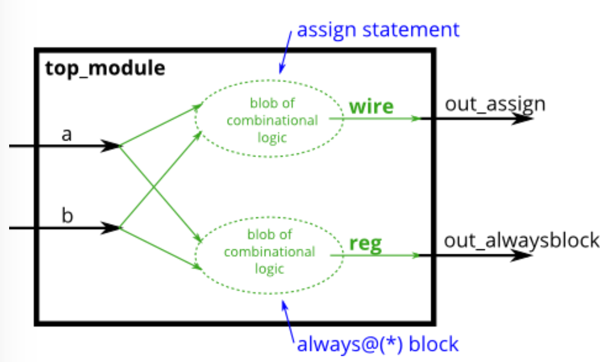
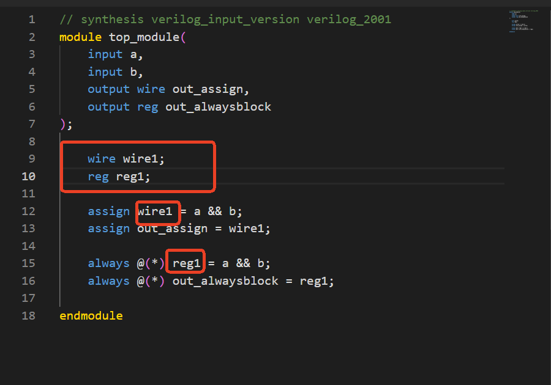
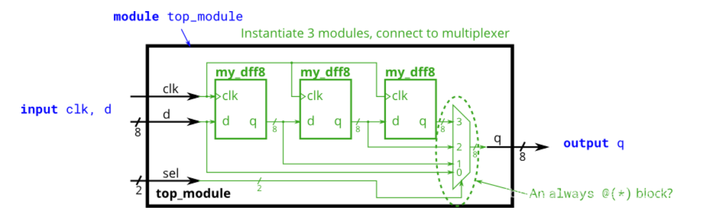

## Verilog练习网址

[verilog在线练习](https://edu.eeeknow.com/exam/lab?uname=1138b6c7f20ffa138c04c6b81515e990&clname=wx)
## verilog语法
###  `default_nettype none     
// Disable implicit nets. Reduces some types of bugs.
这是一个编译器指令（以反引号 ` 开头），不是 Verilog 语言的一部分。

设置当前源文件中，未显式声明的信号，不允许被自动推断为 wire。

隐式 nets 通常是难以检测的错误源。在 Verilog 中，通过赋值语句或将未声明的内容连接到模块端口，可以隐式创建网络类型信号。隐式 nets 始终是单一位宽的导线，并且如果你打算使用向量，它会导致错误。可以使用 default_nettype none 指令禁用隐式 nets 的创建。

```verilog
wire [2:0] a, c;     // 两个向量
assign a = 3'b101;   // a = 101
assign b = a;        // b = 1   隐式创建的导线
assign c = b;        // c = 001  <-- 错误
my_module i1 (d,e);  // 如果没有声明，d 和 e 隐式地是单一位宽。
```
// 如果端口本应是向量，这可能是一个错误。

添加 default_nettype none 将使代码的第二行成为一个错误，这使得错误更容易被发现。

### 组合逻辑
用于硬件综合的always块有两种：


 • 组合逻辑：always @(*)

 • 时钟触发：always @(posedge clk)

对于组合逻辑的always块，应始终使用(`*`) 敏感列表，显式列出信号容易出错，且在硬件综合时会被忽略。如果错过某个信号，综合后的硬件行为仍会像指定了(*)一样，但仿真时会不同步。在assign语句中，左侧必须是网络类型（如wire），而在always块的过程赋值中，左侧必须是变量类型（如reg）。这些类型与硬件综合无关，仅是Verilog作为硬件仿真语言的语法遗留。

> 一个“人口计数”电路用于计算输入向量中'1'的数量。构建一个用于3位输入向量的人口计数电路。
```verilog
module top_module( 
    input [2:0] in,
    output reg [1:0] out );

    // assign out = in[0] + in[1] + in[2];
    // 一直在报!!!!!


    always@(*) out = in[0] + in[1] + in[2];

    
endmodule
```





如果类型不对，会出现语法错误。


### 条件运算符（三元运算符）
用来实现 组合逻辑中基于选择信号的多路选择器（MUX）功能

> condition ? true_value : false_value;


## 逻辑
### 移位寄存器
question：
我们现在有一个模块my_dff8，该模块具有两个输入和一个输出（实现一个8位的D触发器）。实例化它们中的三个，然后将它们链接在一起以构成一个长度为3的8位宽移位寄存器。
此外，创建一个4比1多路复用器，该多路复用器根据sel [1：0]选择输出的内容：输入d的值，在第一个，第二个之后或在第三个D触发器之后。 （**本质上，sel选择从0到3个时钟周期延迟输入的周期。**）
提供模块是：
module my_dff8 ( input clk, input [7:0] d, output [7:0] q );
没有提供多路复用器。一种可能的写方法是在always块中包含case语句。



### 真值表
SOP方法：输入使用“乘积”的形式，将每个为真的输出当作与门的输入

卡诺图：得出电路表达式
### 有符号溢出
这里从溢出发生的情形出发解题，有符号数溢出有两种情况：一是正正相加，产生正溢出;另一种情况是负负相减，产生负溢出。所以就分别考虑了这两种情况，将这两种情况取或判断溢出。
