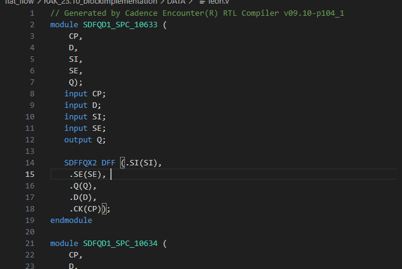
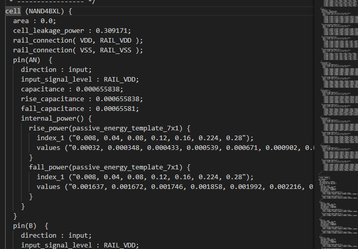
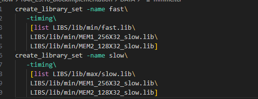
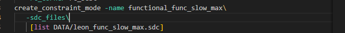
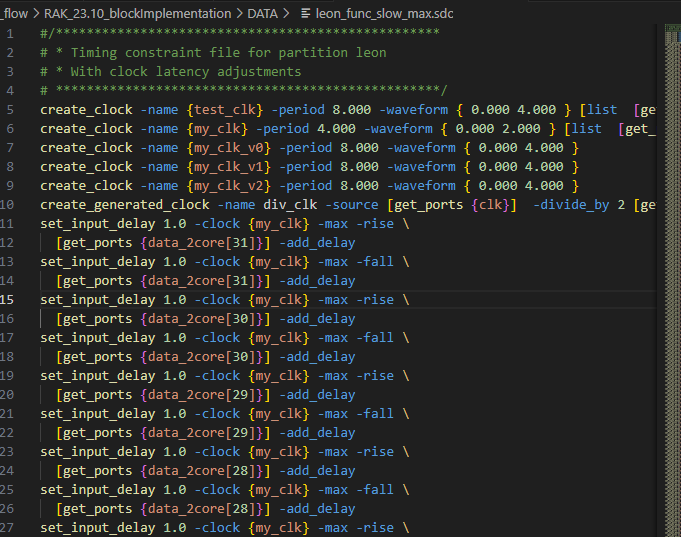

## 后端设计需要导入的设计文件

1. 逻辑综合后的网表netlist（门级）----解决实现什么样的功能  
   ​​

> * 定义了大量与扫描链（scan chain）相关的信号，用于测试和调试。
> * 包含了用于时钟分频和复位处理的电路。
> * 实例化了子模块（如 mcore 和 proc），可能构成了一个完整的处理器或系统核心。
> * 涉及 AHB 总线接口、数据传输和控制信号的传递和管理。

‍

2. lef文件

   > lef  和 def 区别：
   >
   > ‍
   >
   > lef:只告诉你“元器件长什么样、能放哪、怎么连”
   >
   > 元器件的物理规则和抽象几何模型
   >
   > 可以理解为：**LEF**  **=**  **Cell/工艺的物理蓝图 + 设计规则**。
   >
   > ‍
   >
   > def：
   >
   > 设计中元器件的放置和布线实现
   >
   > 可以理解为：**DEF**  **=**  **你的设计的实际布局布线结果**。

‍

3. lib文件：std的属性  
   ​​

4. timing libraries

   ​

5. timing constraints（SDC）  
   ​​

   ​

‍