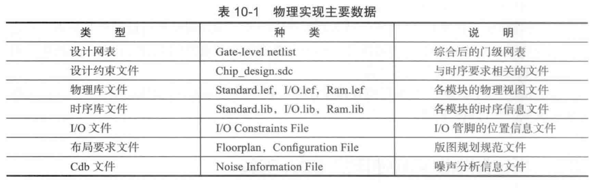
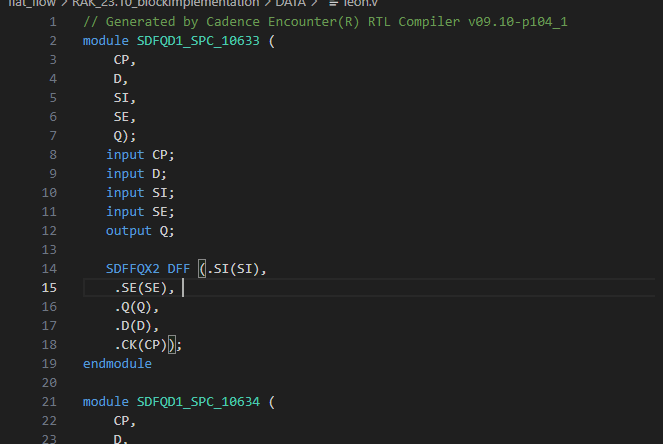
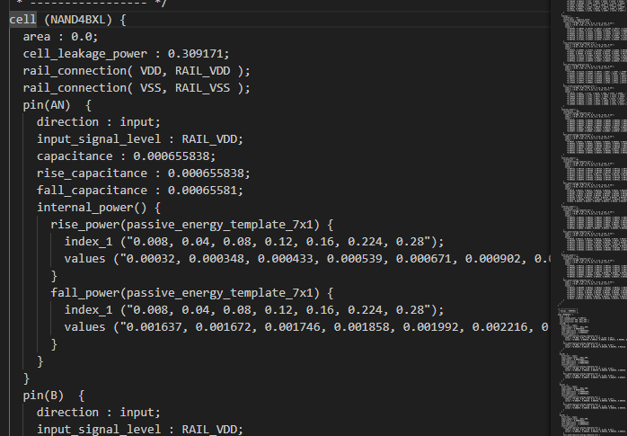
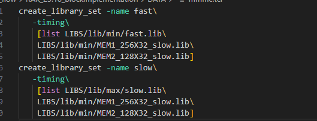
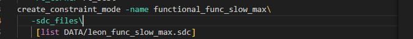
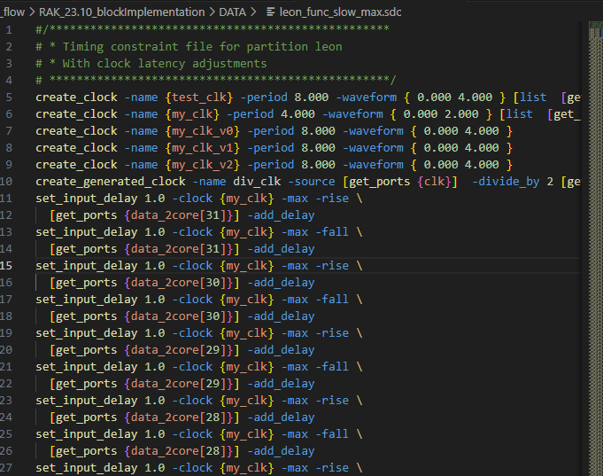

## 后端设计需要导入的设计文件

​​

1. 逻辑综合后的网表netlist（门级）----解决实现什么样的功能  
   ​​

> * 定义了大量与扫描链（scan chain）相关的信号，用于测试和调试。
> * 包含了用于时钟分频和复位处理的电路。
> * 实例化了子模块（如 mcore 和 proc），可能构成了一个完整的处理器或系统核心。
> * 涉及 AHB 总线接口、数据传输和控制信号的传递和管理。

‍

2. lef文件

   > lef  和 def 区别：
   >
   > ‍
   >
   > lef:只告诉你“元器件长什么样、能放哪、怎么连”
   >
   > 元器件的物理规则和抽象几何模型
   >
   > 可以理解为：**LEF**  **=**  **Cell/工艺的物理蓝图 + 设计规则**。
   >
   > ‍
   >
   > def：
   >
   > 设计中元器件的放置和布线实现
   >
   > 可以理解为：**DEF**  **=**  **你的设计的实际布局布线结果**。

‍

3. lib文件：std的属性  
   ​​

4. timing libraries

   ​

5. timing constraints（SDC）  
   ​​

   ​

## clock tree debug

[Clock Tree Debugger](https://www.jianshu.com/p/1e84d86ab3c7)

## 布局规划（Floorplan）
1. 走线资源评估：水平方向，垂直方向走线资源对比 ---> 间距设置。
2. 硬核堆叠高度：根据实际流⽚⼯艺下⼀个中等驱动能⼒的缓冲器（Buffer）可以驱动的合理距离作为参考。
3. 合理电源网络设计：主要问题是电迁移所造成的⾦属连线的击穿问题和⼯作电压衰减所造成的噪声容限下降的问题。需要评估计算电源环和电源条带的宽度和数量。
4. 电压降和EM（电迁移）
5. 电源网络参数确定 power stripe & power ring

## 单元放置（Placement）

## 时钟树综合（Clock Tree Synthesis）

## 全局与细节布线（NanoRoute）

## 电压衰减分析（IR-drop & EM）

## 时序验证与 ECO

## 功能等价性检查

## 物理验证（LVS / ERC / DRC）

## 流片（Tapeout）