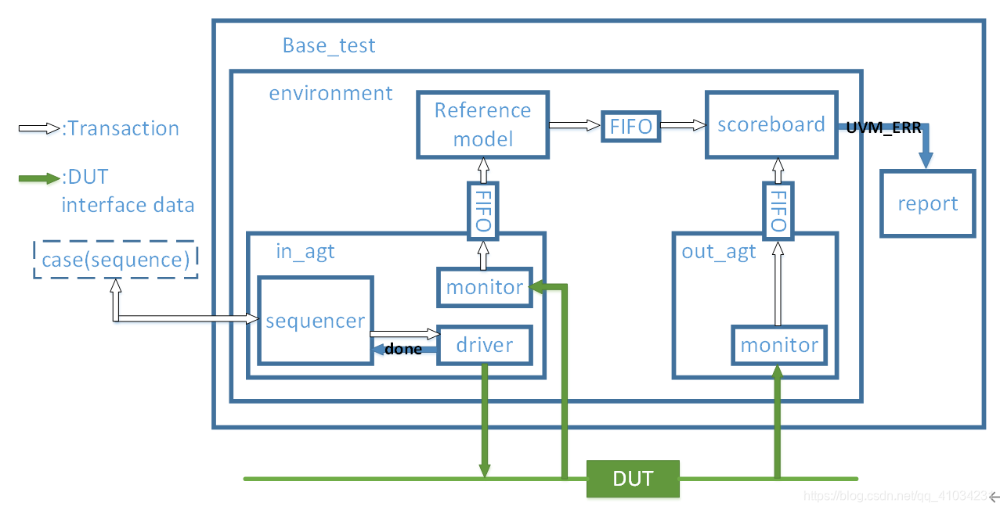

## 前言
1. 验证的本质：尽可能的找出设计的bug

2. 验证的3要素
    (1)灌激励：输入信号
    (2)集响应：输出信号
    (3)作比较：比较

## 《uvm实战》--张强

[UVM验证平台整体结构](https://blog.csdn.net/qq_41034231/article/details/108130501)

## 基础介绍相关link

## Books
[验证书籍](https://github.com/obugss/ebook)
