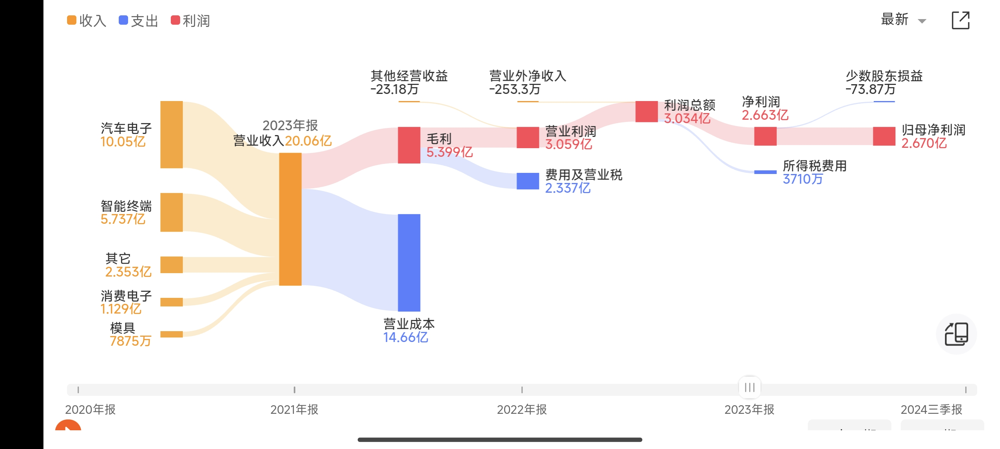

> Big Market决定了一家公司的上限。

## 评估一家公司质地的指标

### 归母净利润

归母净利润（归属于母公司股东的净利润，Net Profit Attributable to Parent Company）是企业财务报表中的一个关键指标，指的是企业在扣除所有成本、费用、税费后，最终归属于母公司股东的净利润。

 $$
\text{归母净利润} = \text{净利润} - \text{少数股东损益}
$$

其中：

净利润：企业的总利润扣除所得税后的最终利润。

少数股东损益：子公司中属于非母公司股东（少数股东）的部分利润。

    净利润:指企业在一定会计期间内，营业收入扣除营业成本、税费、各项费用、投资损益等后的最终利润，反映了企业的最终盈利水平。

### 负债率

$$ \text{负债率} = \frac{\text{总负债}}{\text{总资产}} \times 100\% $$

负债分有息负债与无息负债。有息负债指银行贷款可转债，发行债券等需要还本还息的借款。无息负债一般是指拖欠上下游的经营负债，要还本不用还息。当然如果公司足够强势，其实可以在资产负债表上形成一笔长期经营负债供公司使用。当然从我的角度出发，一切负债都是不稳定的因素。

比如在经营困难的时候，负债是会压倒骆驼的最后一根稻草。我喜欢选择一些低负债率帐面现金多的公司，哪怕公司今年没有一分钱营业收入，把上下游欠款和银行贷款一还，还能靠着资产负债表的现金，产生投资收益利息收入，这样利润表上面不会出现亏损，分红也能持续。这一点很关键，它可以避免股票因为亏损而出现st。哪怕出现最糟糕的情况，清算价值也能拿回70%本金。

流动比率也是一个衡量指标（流动资产/流动负债），这个指标可以反映企业的短期偿债能力，一般我喜欢这个指标大于2的企业。

## 可转债的几个措施

### 强赎

满足特定条件后，公司将可转债强制从持有人手中提前赎回。（强赎条件苛刻）

满足强赎后为什么不发强赎条款 (https://mp.weixin.qq.com/s/Pj1VF6vwEBqVhyHmGD7n1)

### 回售

股价下跌太厉害，要求公司赎回转债。

### 下修

股价下跌太厉害，修改转股价值，将可转债的价格拉回到100面值左右。

