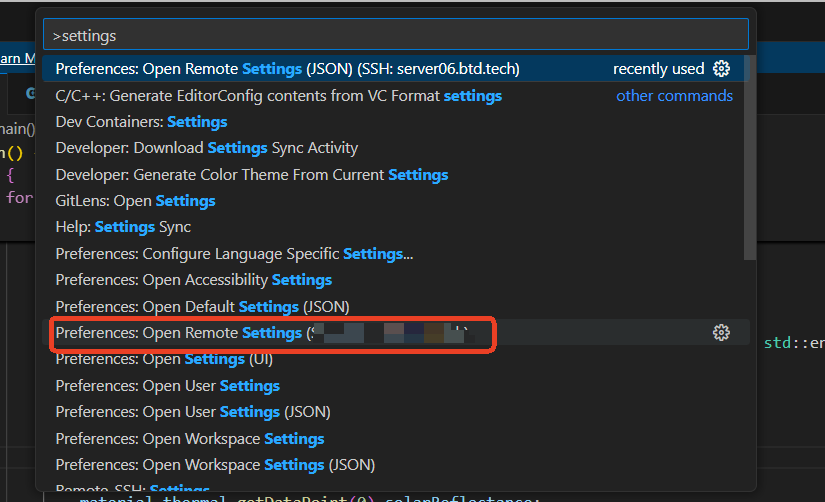

## 1. VSCode中Github Copilot在SSH远程环境中无法登录问题

### 1. 在VS Code中，按F1键调出命令行，输入settings.json，选择远程环境中的配置文件：


### 2. 添加如下配置：
```json

    "remote.extensionKind": {
        "GitHub.copilot": ["ui"],
        "GitHub.copilot-chat": ["ui"],
    },
```
### 3. 重启VS Code即可。

                        

[原文链接](https://blog.csdn.net/qq_43948052/article/details/146123406)

